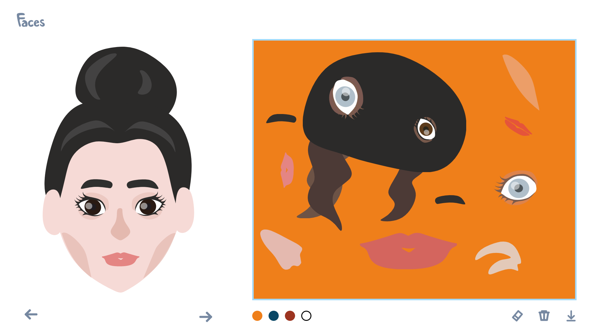

# Faces



## Table of contents
* [General info](#general-info)
* [Technologies](#technologies)
* [Setup](#setup)
* [Live](#live)

## General info
This project was made for my friend, to help her with her art studies.
	
## Technologies
Project is created with:
* HTML
* CSS
* JavaScript
* Konva.js version 7.0.3
	
## Setup
To run this project, install it locally using npm:

```
$ npm install
$ npm run build
```

## Live
You can see it live at [https://kubafila.github.io/faces/](https://kubafila.github.io/faces/).
